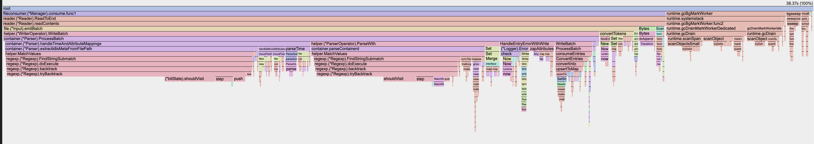
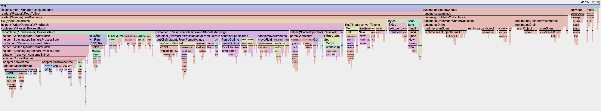

# Container Parser Benchmarks

Performance analysis for the optimisations in `pkg/stanza/operator/parser/container`.

## What is configurable

Three independent knobs — all settable from the collector YAML, no rebuild needed:

| Config field | Values | What it controls |
|---|---|---|
| `use_regex` | `false` (default), `true` | CRI + path metadata: hand-written scanner vs original regex |
| `filepath_cache_type` | `syncmap`, `lru` (default), `none` | Cache for parsed k8s path metadata |
| `disable_map_pools` | `false` (default), `true` | `sync.Pool` reuse for short-lived parse maps |

Example — full baseline (everything as it was before this PR):
```yaml
operators:
  - type: container
    add_metadata_from_filepath: true
    filepath_cache_type: none
    disable_map_pools: true
    use_regex: true
```

---

## Profiles collected

| File | `use_regex` | `filepath_cache_type` | `disable_map_pools` |
|---|---|---|---|
| `regex_nocache_nomap.pprof` | `true` | `none` | `true` |
| `noregex_nocache_nomap.pprof` | `false` | `none` | `true` |
| `noregex_lru_nomap.pprof` | `false` | `lru` | `true` |
| `noregex_syncmap_nomap.pprof` | `false` | `syncmap` | `true` |
| `noregex_lru_map.pprof` | `false` | `lru` | `false` |

All profiles: 30-second CPU sample, kind cluster, single log-spammer pod writing containerd-format lines.

> To view top10 for any profile: `go tool pprof -top <file>.pprof`

---

## Flame graphs

**Before — `regex_nocache_nomap` (true baseline: all regexes, no cache, no pools)**



**After — `noregex_lru_map` (scanner + LRU cache + pools)**



---

## Comparisons

### 1. Scanner vs regex — isolating the scanner gain

`regex_nocache_nomap` → `noregex_nocache_nomap` (same: no cache, no pools)

```
   -10.09s 27.74%   regexp.(*Regexp).tryBacktrack       cum: -16.80s (-46.2%)
    -3.77s 10.37%   regexp.(*bitState).shouldVisit
    -1.40s  3.85%   regexp.(*inputString).step
    +1.94s  5.33%   runtime.mallocgcSmallScanNoHeader   ← more GC, higher throughput
    +1.77s  4.87%   runtime.scanObjectsSmall
```

**Conclusion:** The scanner eliminates 16.80s of cumulative regex CPU — 46% of the entire baseline sample. All `regexp.*` functions vanish completely. GC rises slightly because the collector is now processing more log lines per second (higher throughput means more allocations), not because the scanner is less efficient.

---

### 2. LRU cache vs syncmap cache — isolating the cache implementation

`noregex_lru_nomap` → `noregex_syncmap_nomap` (same: scanner, no pools)

```
    +0.37s  0.89%   runtime.(*mspan).writeHeapBitsSmall
    -0.32s  0.77%   runtime.tryDeferToSpanScan
    -0.21s  0.51%   container.(*Parser).setK8sMetadataFromParsedValues
    -0.21s  0.51%   runtime.mallocgc
```

**Conclusion:** LRU and syncmap are statistically indistinguishable — all diffs are under 0.4s, well within measurement noise between two 30-second samples. Neither cache implementation has a measurable performance advantage over the other for this workload.

---

### 3. Map pools on vs off — isolating the pool benefit

`noregex_lru_nomap` → `noregex_lru_map` (same: scanner, LRU cache)

```
    -0.42s  1.01%   runtime.tryDeferToSpanScan
    -0.33s  0.79%   internal/runtime/maps.(*Iter).Next
    -0.27s  0.65%   golang.org/x/text/encoding/unicode.utf8Decoder.Transform
    -0.20s  0.48%   runtime.mapassign_faststr
```

**Conclusion:** Pools provide a small but consistent reduction in GC-related work (~0.4s across several functions). The numbers are modest in isolation but at the scale of a production node handling tens of thousands of log lines per second, the reduction in map allocations compounds. Pools are cheap to keep.

---

### 4. Full optimisation vs baseline

`regex_nocache_nomap` → `noregex_lru_map` (scanner + LRU + pools)

```
   -10.09s 27.74%   regexp.(*Regexp).tryBacktrack       cum: -16.80s (-46.2%)
    -3.77s 10.37%   regexp.(*bitState).shouldVisit
    -1.40s  3.85%   regexp.(*inputString).step
    +1.64s  4.51%   runtime.mallocgcSmallScanNoHeader   ← throughput increase
    +1.44s  3.96%   runtime.scanObjectsSmall
```

**Conclusion:** All regex CPU is eliminated. The remaining profile is dominated entirely by Go runtime GC — `mallocgcSmallScanNoHeader`, `scanObjectsSmall`, `mallocgc` — which is the theoretical floor for any Go program doing this volume of map allocations. There is no container-parser-specific work left in the top functions.

---

## Why LRU is the right cache choice

The path metadata cache stores `log.file.path → k8s metadata` entries. The access pattern is:
- **Write once** per unique file path (when a container starts)
- **Read millions of times** for the lifetime of that file
- **Stale entries** accumulate as pods die and restart (old paths are never explicitly evicted)

LRU handles this correctly: when the cache is full, the least-recently-used path is evicted. Dead pod paths naturally fall to the bottom of the LRU queue since they stop receiving reads, so they're the first to go when space is needed. The syncmap implementation uses a FIFO channel for eviction — it evicts the oldest-inserted entry regardless of access frequency, which could evict an actively-used path if it was inserted early. But the main advantage of the lru cache it the fact its less API to manage.

**Why not other libraries?**

| Library | Notes |
|---|---|
| `github.com/hashicorp/golang-lru/v2` | Chosen — already in the contrib repo's dependency tree, generic typed API, thread-safe, well-maintained |
| `github.com/patrickmn/go-cache` | TTL-based, not LRU — wrong eviction model for this use case (paths don't expire on a timer) |
| `github.com/dgraph-io/ristretto` | High-performance but adds a large dependency for a simple bounded cache |
| `sync.Map` (helper.SyncMapCache) | FIFO eviction, more code to maintain internally |

---

## Micro-benchmarks (Apple M5 Pro, Go 1.24, 5s)

Here the numbers dffer each time, however the percentage difference stays the same

### CRI line parsing: scanner vs regex

```
BenchmarkContainerdCRIParsing/Regex/Containerd     538 ns/op   564 B/op   8 allocs/op
BenchmarkContainerdCRIParsing/NoRegex/Containerd   160 ns/op   416 B/op   7 allocs/op  (~3.4×)

BenchmarkCRIOParsing/Regex/CRIO     603 ns/op   564 B/op   8 allocs/op
BenchmarkCRIOParsing/NoRegex/CRIO   158 ns/op   416 B/op   7 allocs/op  (~3.9×)
```

### Log path parsing: scanner vs regex

```
BenchmarkLogPathParsing/Regex/Standard    1750 ns/op   739 B/op   9 allocs/op
BenchmarkLogPathParsing/NoRegex/Standard   210 ns/op   416 B/op   7 allocs/op  (~7.9×)
```

### Cache type comparison

```
BenchmarkCacheTypes/syncmap   1220 ns/op   2043 B/op   43 allocs/op
BenchmarkCacheTypes/lru       1225 ns/op   2043 B/op   43 allocs/op
BenchmarkCacheTypes/none      1400 ns/op   2128 B/op   48 allocs/op  (+10%)
```

---

## Collecting pprof from kind

### Build and deploy (once, or after code changes)

```bash
# Build for linux/arm64
GOOS=linux GOARCH=arm64 make otelcontribcol

# Package and load into kind
cp bin/otelcontribcol_linux_arm64 cmd/otelcontribcol/otelcontribcol
docker build -t otelcol-dev:latest cmd/otelcontribcol/
kind load docker-image otelcol-dev:latest --name otel-test

# Deploy (first time)
kubectl apply -f benchmarks/resources/otel-config.yaml
kubectl apply -f benchmarks/resources/otel-daemonset.yaml

# Or update image after rebuild
kubectl set image daemonset/otelcol otelcol=otelcol-dev:latest
kubectl rollout restart daemonset/otelcol && kubectl rollout status daemonset/otelcol
```

### Change config and collect (no rebuild needed)

```bash
# Edit the knobs
vim benchmarks/resources/otel-config.yaml

# Apply and restart
kubectl apply -f benchmarks/resources/otel-config.yaml
kubectl rollout restart daemonset/otelcol && kubectl rollout status daemonset/otelcol

# Collect
kubectl port-forward daemonset/otelcol 1777:1777 &
curl -o my_config.pprof "http://localhost:1777/debug/pprof/profile?seconds=30"

# Analyse
go tool pprof -http=:8080 my_config.pprof
go tool pprof -top -diff_base=resources/regex_nocache_nomap.pprof my_config.pprof
```

---

## Links

- [Optimisation PR](https://github.com/open-telemetry/opentelemetry-collector-contrib/pull/50087)
- [Tracking issue](https://github.com/open-telemetry/opentelemetry-collector-contrib/issues/41672)
- [Related PR #44487](https://github.com/open-telemetry/opentelemetry-collector-contrib/pull/44487)
- [pprof extension](https://github.com/open-telemetry/opentelemetry-collector-contrib/tree/main/extension/pprofextension)
